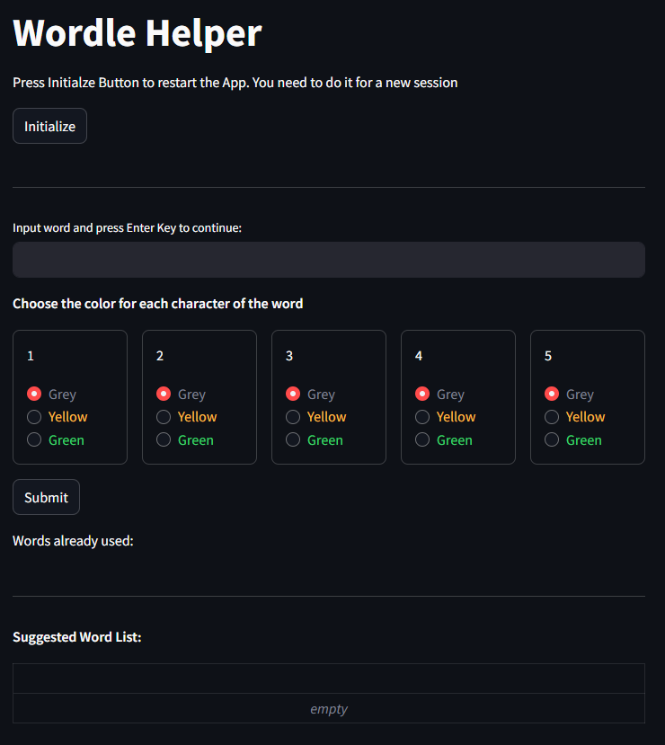

# Wordle Helper
*Just another wordle helper.*

Funny thing is it started out as an ambitious project using Ollama based local LLM like Qwen or Llama. After lots of efforts in prompt formatting and structured output mishaps, the application was very slow and was not consistent (for the same input sometimes if would provide different outputs).
So I dusted up my thinking cap and develop it using **non AI** tools (that is my brain of course.)
## How it works
We have a list of words in words directory called 'words_sorted.json'. This file was prepared from the word list I got from following repo. Special thanks to [dwyl](https://github.com/dwyl) for this repo.

[English Words Repo](https://github.com/dwyl/english-words)

In the App, user input text and character colors like Grey, Yellow and Green. Based on this input, we search the word list and output a list. Every subsequent try will shorten the list unless it is left with few or one word that would be the answer. 

## App User Guide
Start your favorite wordle app, give some initial guess. 
Now launch this wordle solver and input your guess word and its colors.

**A:** Lets say we input 'clear' as first guess

**B:** Launch the Wordle Helper App 

1. Enter the guess word in text box and press 'Enter' key (This will make this word appear below the radio button boxes)
2. For each character, choose the color from radio buttons. In the above example, C and E are Yellow and rest are Grey.
3. Press the 'Submit' Button. 

**C:** Pressing Submit Button will trigger the following

1. The guess word will be added to section with heading 'Words already used'
2. A table of suggested words will be displayed. These words are following the color code logic. For example in the above example, L, A and R are grey. It means we must exclude all words with these characters. Also C is yellow meaning it is contained in the word but not in the first position. 

**D:** You can choose any word from the suggested word list and use it as your second guess. Lets assume we choose 'DICES' as out second guess. Input it in Wordle and check for output

In this case , we can see that I, C and E are marked as green. So we provide this input to out wordle helper.

**E:** Here we basically perform the steps already mentioned before with new guess word 'DICES'

1. We input the word 'dices' in input box and press Enter
2. We choose colors for each character. In this case D and S are Grey. I, C and E are Green.
3. We press Submit Button
4. The suggested list is now down to only one word. That must be the answer.!!!

**F:** Yes, it is the answer

**G:** Press 'Initialize' to restart the app and basically clear out all the previous lists/variables. Initialize button will clear the suggested word list, already used word list and input text. So you can start another round of wordle.

## End of file
